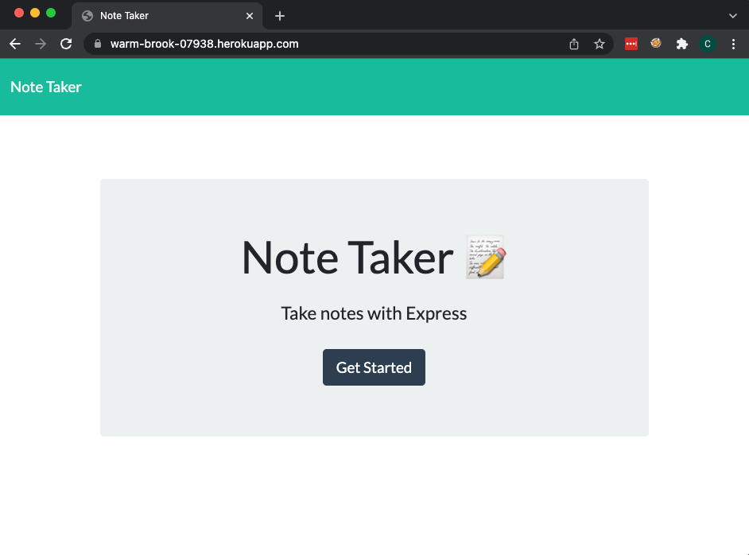

# Note Taker Application 
<div id="top"></div>

<!-- TABLE OF CONTENTS -->
<details>
  <summary>Table of Contents</summary>
  <ol>
    <li>
      <a href="#about-the-project">About The Project</a>
      <ul>
        <li><a href="#built-with">Built With</a></li>
      </ul>
    </li>
    <li>
      <a href="#getting-started">Getting Started</a>
      <ul>
        <li><a href="#prerequisites">Prerequisites</a></li>
        <li><a href="#installation">Installation</a></li>
      </ul>
    </li>
    <li><a href="#usage">Usage</a></li>
    <li><a href="#contact">Contact</a></li>

  </ol>
</details>


<!-- ABOUT THE PROJECT -->
## About The Project



This class project is to create a backend with Node.js that allows uses to take notes.

About:
* This is an unauthenticated example note taking app with shared notes
* The code leverages Express for routing 
* The app allows users to create and view text notes 


<p align="right">(<a href="#top">back to top</a>)</p>


### Built With

* [Node.js](https://nodejs.dev/)
* [Express.js](https://expressjs.com/)


<p align="right">(<a href="#top">back to top</a>)</p>


<!-- GETTING STARTED -->
## Getting Started

To get a local copy up and running follow these simple example steps.

### Prerequisites

* npm
  ```sh
  npm install npm@latest -g
  ```

### Installation

1. Clone this repo 
    ```sh
    git clone git@github.com:anon123123123/du-note-taker-proj-9.git
    ```
2. Install NPM packages
    ```sh
    npm install
    ```


<p align="right">(<a href="#top">back to top</a>)</p>


<!-- USAGE EXAMPLES -->
## Usage

Once installed run `npm run start` and visit http://localhost:3001. Or visit the Heroku hosted version:
[Hosted Note Taker](https://warm-brook-07938.herokuapp.com/)

- Click "Get Started"
- To view notes: Simply click the note you wish to view on the left hand side
- To add notes Click the "+" in the top right
- Type a title and the note then click the Save icon that appears in the top right
- Click the Delete Icon to remove a note 


<p align="right">(<a href="#top">back to top</a>)</p>


<!-- CONTACT -->
## Contact

Project Link: [https://github.com/anon123123123/du-note-taker-proj-9](https://github.com/anon123123123/du-note-taker-proj-9)

<p align="right">(<a href="#top">back to top</a>)</p>


